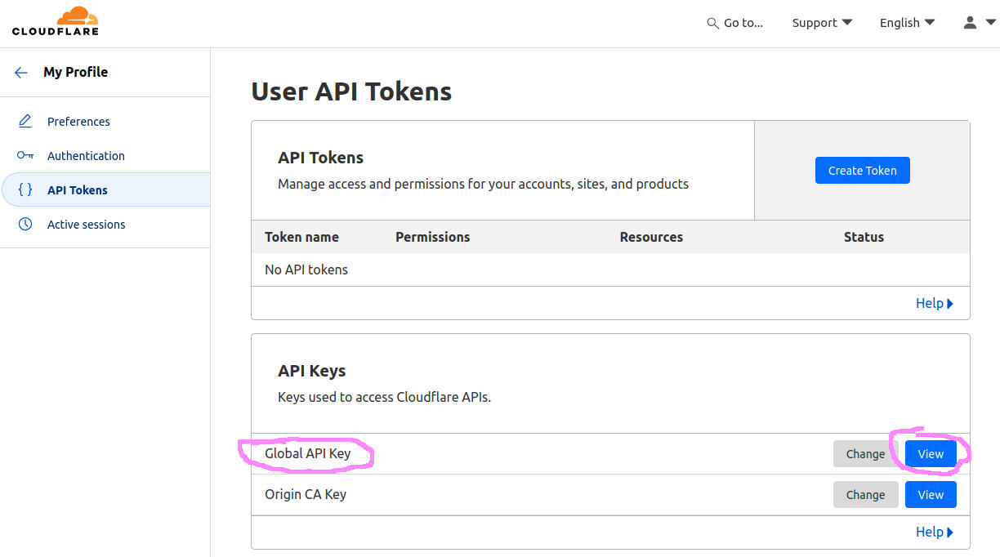

# Installation, Part 2: Cloudflare
> Cloudflare configuration is optional.

The purpose of this integration point is to allow your stack to retrieve and renew Let's Encrypt SSL certificates automatically, by using Cloudflare's DNS challenge. There are other ways to retrieve SSL certificates, but I prefer this method as it gives the most flexibility&mdash;and makes it super easy to spin up additional containers and services on the host machine, because the SSL certificate you will get will be a wildcard that allows adding on whatever additional sub-domains you desire.

The good news is that a lot of the work for this is handled automagically by Traefik and the config file we give it! All you need to do is plug in a valid Cloudflare API key and it should just work.

## Configuring Cloudflare
First of all, I'm assuming you already use Cloudflare as your domain registrar / DNS service. If not, then I'm not sure if any of this would work. Note that you do NOT need a paid / Pro account; these instructions work just fine with a free tier account.

Log into your Cloudflare dashboard and go to your profile, at https://dash.cloudflare.com/profile

What you want is the key labelled `Global API Key`, circled in pink here:

You can change this value at any point (and probably should every few months) but for now just click the View button. You will be prompted for your password, as this is sensitive information. Once you see the popup with the key, copy it and paste it into the `.env` file.

The email address that goes with the key is the same address you use to log into your Cloudflare account. There is a second email address in this section called `ACME_EMAIL`. That does NOT have to match your Cloudflare account; it can be any valid email address. This is something Let's Encrypt uses to warn you about a certificate that's going to expire (which I've seen only once in however many years they've been issuing certs, and I believe they are discontinuing these soon if they haven't already).

The rest of the config needed is already done for you.

## Removing or Replacing This Integration
If you don't want this integration, there are several files you'll have to modify, either by replacing these areas with one for your provider, or by removing them.

I've marked each piece of the integration with a comment, so just search for `Cloudflare` to find them all. Alternative DNS challenge providers are listed in the Traefik documentation, [here](https://doc.traefik.io/traefik/https/acme/#providers).