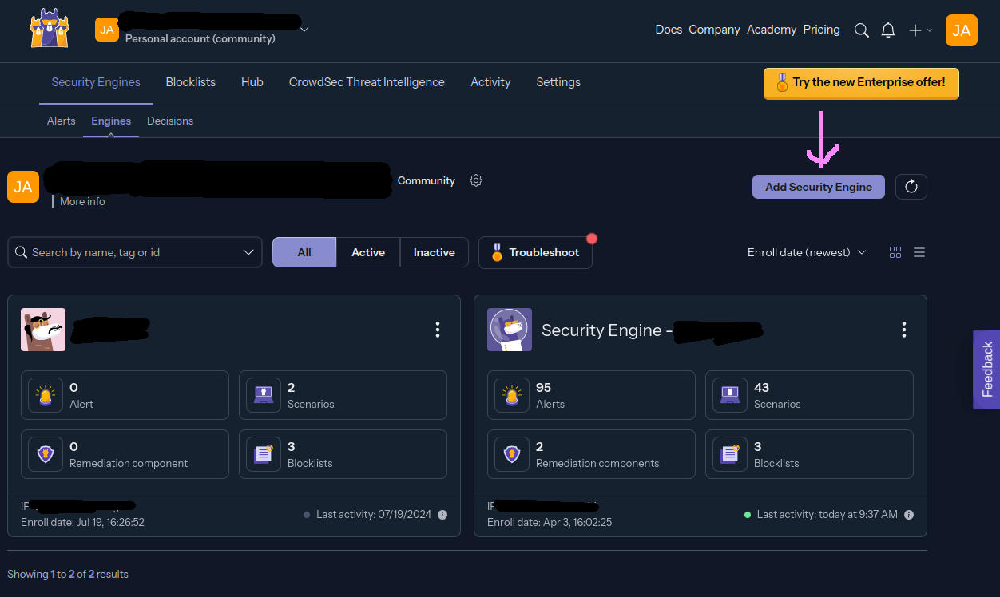

# Installation, Part 3: Crowdsec
Crowdsec integration is optional.

The purpose of this integration point is to add crowdsourced threat assessments to your Ghost blog, so that your host machine can automatically reject incoming connections from known bad IP addresses and detect new threats&mdash;and block them, and contribute that knowledge back to the crowd.


## Configuring Crowdsec
Start by setting up your account with them at: https://app.crowdsec.net/

### CAPI Key
Their free accounts have limitations, but nothing too annoying for a small self-hoster like me. What you want to do is add a new "Security Engine" using the button here:



This will bring you to a screen telling you how to enroll your security engine. The part you really need is the bash command near the bottom. Something like:
```bash
sudo cscli console enroll -e context (key)
```
This random value is your CAPI key&mdash;the secret value that is used for communicating from your host to their **Central API**.

Update your environment file and plug this into the CAPI section, along with a nice name for more easily finding this engine in your Crowdsec console:
```ini
# Part 3: Crowdsec
## Crowdsec enrollment for registering the engine with their console
CROWDSEC_CAPI_KEY=(get from console)
CROWDSEC_CAPI_NAME=(whatever you want)
```

> NOTE: The rest of the Crowdsec config is not too difficult. You don't have to worry about most of it because this config handles loading default rules for both Traefik and a Linux host. But you should review the Blocklists. They let you subscribe to three as a free user. Pick any that seem good to you.


## LAPI Key
You also need a LAPI Key&mdash;for communicating via a **Local API**. This is super easy because you have total control over it. There are two places this value has to go, and I've wired up the environment variable to both for you.

Look at the Crowdsec section of the environment file:
```ini
## Traefik plugin version (so you don't have to manually edit traefik-config.yml)
## Check https://github.com/maxlerebourg/crowdsec-bouncer-traefik-plugin
BOUNCER_VERSION="v1.4.2"

## Bouncer key for Traefik's local API
## Generate something like a GUID for this. It's used internally by Traefik
## to querying Crowdsec to see if incoming traffic should be bounced.
BOUNCER_KEY_TRAEFIK=(generate)
```

You can type anything here, but it will be more secure if you generate a GUID. In Linux or Mac, use:
```bash
uuidgen | tr -d "-"
```
and on Windows / Powershell, you can use
```powershell
New-Guid
```
and remove the hyphens. It's been a while since I've used Powershell (or Windows for that matter) but you can likely run something like this if you like one-liners:
```powershell
[System.Guid]::NewGuid().ToString("N").replace("-","")
```


Paste the value in and you're set.

> **NOTE:** At least for the time being, you will have to manually check for updates to the bouncer plugin, and manually update the traefik config file.


## Updating Crowdsec With Cron
In addition to periodically updating the Crowdsec container and Traefik plugin, you also have to manually invoke ruleset updates inside the container. Thankfully this can be accomplished pretty easily with a simple cron job.

Assuming you are on a modern Linux host, you should be able to create a cron job with:
```bash
crontab -e
```
Choose an editor if you haven't already set one up, and then paste this at the bottom of the file:
```bash
0 0 * * * docker exec crowdsec cscli hub update && docker exec crowdsec cscli hub upgrade
```
This will run the command at midnight every day. I'm not sure how often this should be run, but I've been running it daily and it completes in a few seconds, but typically only updates something once or twice a week.


## Removing This Integration
The two Traefik config files handle the entirety of this integration. You can comment or delete any sections that have the word `crowdsec` in them.

All integration points should be marked with a `Crowdsec` related comment.
