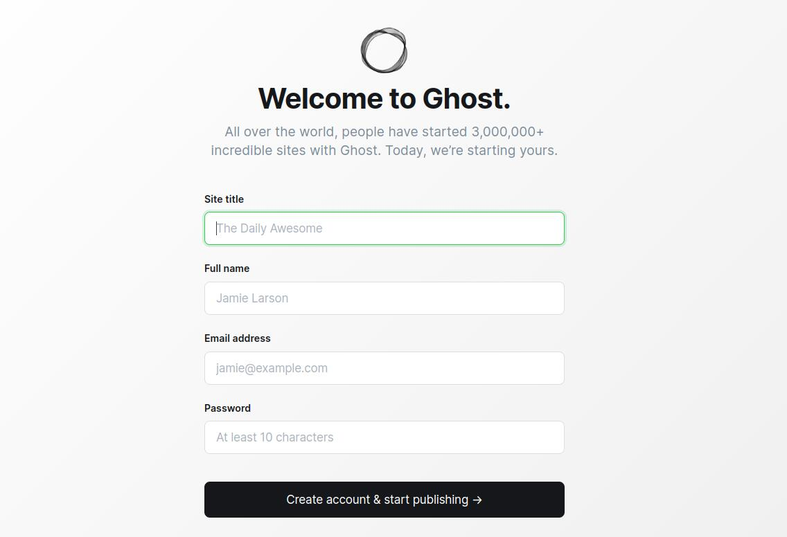

# Installation, Part 5: Running Ghost For the First Time
Now all the config is in place, and we're ready to run Ghost for the first time! During this step, Ghost should automatically create all the needed database tables and it will launch in maintenance mode. I'll walk you through what's needed to get this to the point of using it.

Start by composing up:
```bash
docker compose up -d
```
It should automatically pull containers and run them. Once all containers are running, you should take a moment to visit Crowdsec (if you're using that part of the config) and accept the enrollment of your new security engine. This will add an entry to your list, which you can then configure with blocklists and any other settings you like.

Now let's surf to Ghost, which should be running at the address you set for the `BLOG_URL` environment variable and you should see your site:


If you're new to Ghost, then what you really want to do is add `/ghost` to the end of the URL, which will let you log into the admin panel. The first time you come here, it prompts for you to name your site and create your admin account:



They walk you through the rest of the process from there. Have fun!

